# AI-Powered Resume Analyzer & Career Resume Coach

An AI-powered web application that analyzes a candidate's PDF resume against their target career and generates a structured resume review.

The system combines **Prompt Engineering, Google Gemini, Flask, PDF text extraction, ATS analysis, career matching, resume scoring, and structured AI outputs** to provide practical resume improvement guidance.

This project was developed as part of the **Vault of Codes Prompt Engineering Internship**.

---

## 📌 Project Overview

The **AI-Powered Resume Analyzer & Career Resume Coach** allows students, freshers, and job seekers to upload a PDF resume and provide information about their target career.

The application extracts the resume content and processes it through a modular **8-prompt AI pipeline**.

The final report includes:

- Overall Resume Score
- ATS Readiness Score
- Career Match Score
- Resume Strengths
- Key Problems
- Missing Information
- Grammar & Consistency Issues
- Content Improvement Suggestions
- Priority Improvement Plan
- Top Actions
- Final Recommendation

The application is designed to provide useful career guidance without inventing skills, achievements, technologies, or experience that are not supported by the candidate's resume.

---

# ✨ Features

## 📄 Resume Processing

- PDF resume upload
- PDF-only validation
- Maximum file size validation
- Multi-page PDF support
- Resume text extraction using PyMuPDF
- Detection of unreadable or invalid PDFs
- Character and page count extraction

## 👤 Student Information

Users can provide:

- Full Name
- Current Education
- Degree / Course
- Current Year / Stage

## 🎯 Career Goal Information

Users can specify:

- Target Job Role
- Target Industry
- Career Goal
- Experience Level
- Preferred Job Type
- Skills to Highlight
- Current Career Purpose

## 🤖 AI Resume Analysis

The AI analyzes:

- Resume structure
- Resume quality
- Career alignment
- ATS readiness
- Grammar and consistency
- Missing information
- Content improvement opportunities
- Overall resume readiness

## 📊 Resume Scoring

The system provides:

- Overall Resume Score
- Resume Quality Score
- ATS Readiness Score
- Career Match Score
- Content Completeness Score
- Error & Consistency Score
- Content Strength / Evidence Score

## 🌙 User Interface

- Responsive interface
- Professional report layout
- Dark mode
- Structured result cards
- Priority-based recommendations
- Resume analysis dashboard

---

# 🖼️ Application Screenshots

## Homepage

The homepage introduces the AI Resume Analyzer and allows users to begin the resume review process.

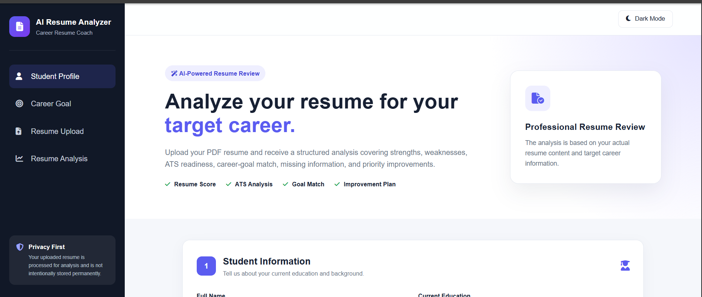

---

## Student Information

Users enter their current education and academic background before starting the analysis.

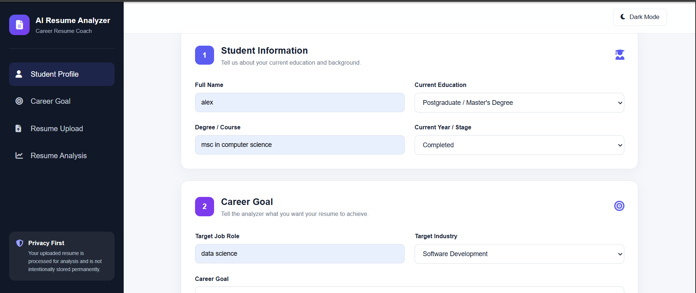

---

## Career Goal

Users specify their target job role, industry, career goal, experience level, and preferred job type.

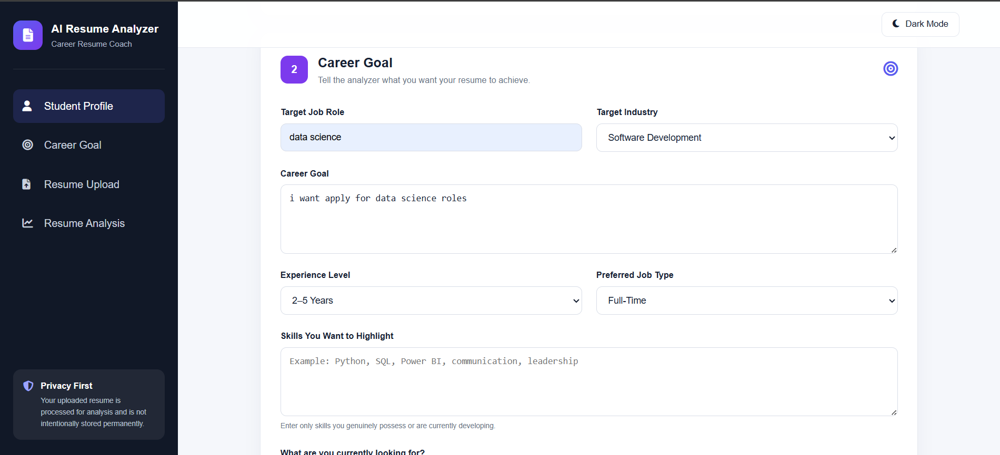

---

## Analyze Resume

After entering the required information and uploading a PDF resume, the user can start the analysis.

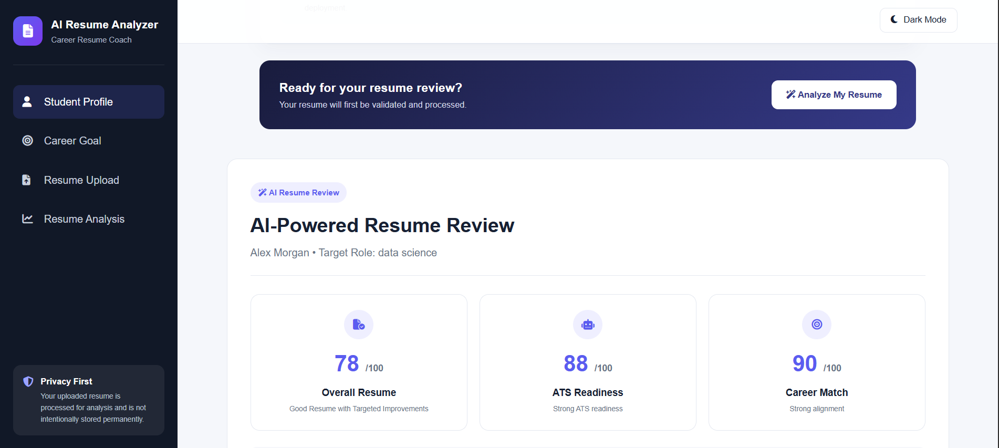

---

## AI Resume Analysis Report

The final report presents the overall resume score, ATS readiness, career match, and detailed AI analysis.

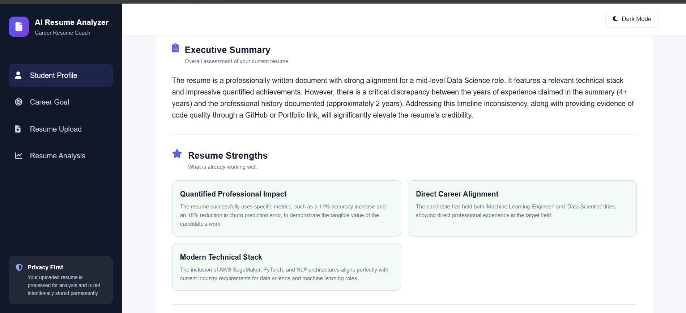

---

## Career Goal Match

The application compares the candidate's existing resume with the selected target career.

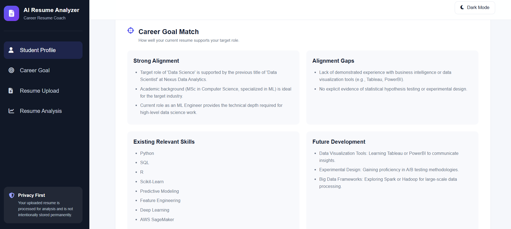

---

## Key Problems in Resume

Important resume problems are identified along with their priority, reason, and recommended action.

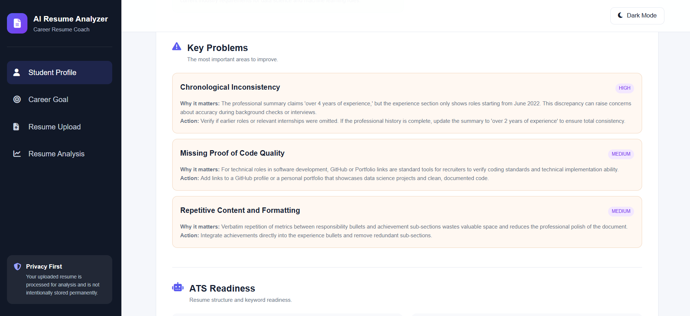

---

## Resume Improvements

The application generates practical improvement recommendations while preserving the candidate's actual experience.

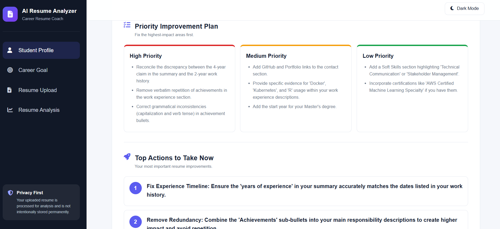

---

## Updated Resume Suggestions

The system provides content improvement guidance based on the candidate's existing resume information.

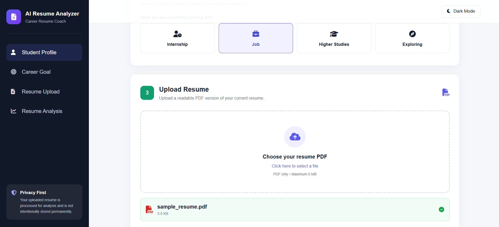

---

## Final Recommendation

A final career-focused recommendation summarizes the most important improvements the candidate should make.

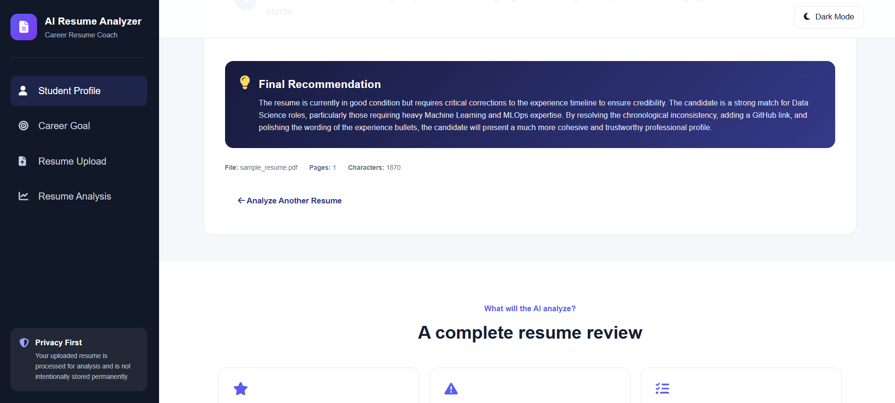

---

## Dark Mode

The application also supports a dark-mode interface.

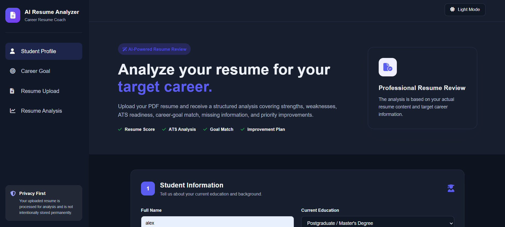

---

# 🧠 Prompt Engineering Architecture

Instead of sending the entire task through one large AI prompt, this project uses a modular **8-prompt pipeline**.

```text
PDF Resume
    │
    ▼
Resume Text Extraction
    │
    ▼
Prompt 1 ── Resume Structure
    │
    ▼
Prompt 2 ── Quality Analysis
    │
    ▼
Prompt 3 ── Career Match
    │
    ▼
Prompt 4 ── ATS Analysis
    │
    ▼
Prompt 5 ── Error Detection
    │
    ▼
Prompt 6 ── Missing Information
    │
    ▼
Prompt 7 ── Content Improvement
    │
    ▼
Prompt 8 ── Final Report
    │
    ▼
AI Resume Review
```

---

# 🧩 8-Prompt Pipeline

## Prompt 1 — Resume Structure

**File**

```text
prompts/01-resume-structure.txt
```

Extracts and organizes information from the uploaded resume into structured JSON.

Typical information includes:

- Candidate information
- Professional summary
- Education
- Technical skills
- Soft skills
- Work experience
- Internships
- Projects
- Certifications
- Achievements
- Languages
- Other detected sections

---

## Prompt 2 — Resume Quality Analysis

**File**

```text
prompts/02-quality-analysis.txt
```

Evaluates the overall quality of the resume.

It considers:

- Section quality
- Professional clarity
- Resume structure
- Existing strengths
- Weak content
- High-priority quality issues

---

## Prompt 3 — Career Match Analysis

**File**

```text
prompts/03-career-match.txt
```

Compares the resume against the user's selected career goal.

It evaluates:

- Target role alignment
- Relevant existing skills
- Strong alignment points
- Weakly demonstrated skills
- Career alignment gaps
- Recommended development areas

---

## Prompt 4 — ATS Analysis

**File**

```text
prompts/04-ats-analysis.txt
```

Evaluates resume readiness for Applicant Tracking Systems.

It reviews:

- Section headings
- Resume readability
- Keyword coverage
- Relevant keywords
- Missing or weakly represented keywords
- ATS strengths
- ATS issues
- Priority ATS improvements

---

## Prompt 5 — Error Detection

**File**

```text
prompts/05-error-detection.txt
```

Checks the resume for:

- Grammar issues
- Wording problems
- Repetition
- Terminology inconsistencies
- Timeline inconsistencies
- Formatting consistency
- Information requiring candidate verification

---

## Prompt 6 — Missing Information Analysis

**File**

```text
prompts/06-missing-information.txt
```

Identifies important information that may be:

- Missing
- Incomplete
- Weakly demonstrated
- Candidate-verification dependent

The prompt also avoids treating optional sections as mandatory.

---

## Prompt 7 — Content Improvement

**File**

```text
prompts/07-content-improvement.txt
```

Generates practical content improvements while preserving the candidate's real experience.

It can provide:

- Improved professional summary
- Project description improvements
- Internship improvements
- Work experience improvements
- Skills presentation improvements
- Wording improvements
- Future development areas

The prompt is designed not to fabricate unsupported candidate information.

---

## Prompt 8 — Final Report Generation

**File**

```text
prompts/08-final-report.txt
```

Combines the previous analyses into the final structured resume review.

The final report contains:

- Scores
- Executive summary
- Resume strengths
- Key problems
- ATS review
- Career goal review
- Missing information
- Errors and consistency
- Content improvements
- Priority action plan
- Top actions
- Final recommendation

---

# 📊 Resume Scoring Methodology

The overall resume score is based on six components.

| Component | Weight |
|---|---:|
| Resume Quality | 25% |
| ATS Readiness | 20% |
| Career Goal Match | 20% |
| Content Completeness | 15% |
| Error & Consistency Quality | 10% |
| Content Strength / Evidence | 10% |
| **Total** | **100%** |

## Formula

```text
Overall Resume Score =

(Resume Quality Score × 0.25)
+
(ATS Readiness Score × 0.20)
+
(Career Match Score × 0.20)
+
(Content Completeness Score × 0.15)
+
(Error & Consistency Score × 0.10)
+
(Content Strength / Evidence Score × 0.10)
```

The final result is rounded to the nearest whole number.

The overall score is therefore derived from the component scores instead of being an arbitrary standalone value.

---

# 📈 Score Interpretation

| Score | Interpretation |
|---:|---|
| 85–100 | Strong Resume |
| 70–84 | Good Resume with Targeted Improvements |
| 50–69 | Moderate Resume Requiring Meaningful Improvement |
| 30–49 | Weak Resume Requiring Major Improvement |
| 0–29 | Very Weak or Highly Incomplete Resume |

---

# 🎓 Fresher Fairness

The scoring methodology does not automatically reduce a candidate's score simply because they are a student or fresher.

For students and freshers, the analyzer can consider evidence such as:

- Education
- Academic projects
- Personal projects
- Internships
- Certifications
- Coursework
- Technical skills
- Practical implementation
- Achievements

Professional employment history is not treated as mandatory when the candidate's experience level does not reasonably require it.

---

# 🛠️ Technology Stack

## Backend

- Python
- Flask
- Google Gemini API
- Google GenAI Python SDK
- PyMuPDF
- python-dotenv

## Frontend

- HTML5
- CSS3
- JavaScript

## AI

- Google Gemini
- Prompt Engineering
- Structured JSON outputs
- Multi-stage AI pipeline

## Testing

- Pytest

## Deployment

- Gunicorn
- Flask-compatible hosting

---

# 📁 Project Structure

```text
AI-Resume-Analyzer/
│
├── prompts/
│   ├── 01-resume-structure.txt
│   ├── 02-quality-analysis.txt
│   ├── 03-career-match.txt
│   ├── 04-ats-analysis.txt
│   ├── 05-error-detection.txt
│   ├── 06-missing-information.txt
│   ├── 07-content-improvement.txt
│   └── 08-final-report.txt
│
├── screenshots/
│   ├── analyse_button.png
│   ├── Analysis_report.png
│   ├── career_goal_match.png
│   ├── career_goal.png
│   ├── Dark_mode.png
│   ├── Final_recommendation.png
│   ├── Homepage.png
│   ├── improvements.png
│   ├── Key_problem_in_resume.png
│   ├── student_information.png
│   └── updated_resume.png
│
├── static/
│   ├── script.js
│   └── style.css
│
├── templates/
│   └── index.html
│
├── tests/
│   ├── conftest.py
│   ├── test_final_report.py
│   ├── test_mock_pipeline.py
│   ├── test_pdf_processing.py
│   ├── test_profile_validation.py
│   └── test_scoring.py
│
├── uploads/
│   └── .gitkeep
│
├── .env
├── .gitignore
├── app.py
├── requirements.txt
└── README.md
```

> `.env` and uploaded resume files are excluded from Git using `.gitignore`.

---

# ⚙️ Installation and Setup

## 1. Clone the Repository

```bash
git clone YOUR_GITHUB_REPOSITORY_URL
```

Move into the project directory:

```bash
cd AI-Resume-Analyzer
```

---

## 2. Create a Virtual Environment

```bash
python -m venv venv
```

### Windows PowerShell

```powershell
.\venv\Scripts\Activate.ps1
```

If PowerShell prevents activation:

```powershell
Set-ExecutionPolicy -Scope Process -ExecutionPolicy RemoteSigned
.\venv\Scripts\Activate.ps1
```

---

## 3. Install Dependencies

```bash
pip install -r requirements.txt
```

---

# 🔐 Environment Variables

Create a `.env` file in the root directory.

For full AI mode:

```env
GEMINI_API_KEY=your_gemini_api_key
GEMINI_MODEL=your_gemini_model

USE_AI=true
AI_PROMPT_LIMIT=8
```

Replace the placeholders with your actual Gemini configuration.

**Never upload your real Gemini API key to GitHub.**

The `.env` file is ignored through `.gitignore`.

---

# 🤖 AI Mode

To execute all eight Gemini prompts:

```env
USE_AI=true
AI_PROMPT_LIMIT=8
```

When the application starts, the terminal should show:

```text
========================================
AI Resume Analyzer
USE_AI: True
AI_PROMPT_LIMIT: 8
Gemini enabled for prompts 1 to 8.
========================================
```

During a successful full analysis:

```text
========== RUNNING PROMPT 1 ==========
Prompt 1 completed successfully.

========== RUNNING PROMPT 2 ==========
Prompt 2 completed successfully.

========== RUNNING PROMPT 3 ==========
Prompt 3 completed successfully.

========== RUNNING PROMPT 4 ==========
Prompt 4 completed successfully.

========== RUNNING PROMPT 5 ==========
Prompt 5 completed successfully.

========== RUNNING PROMPT 6 ==========
Prompt 6 completed successfully.

========== RUNNING PROMPT 7 ==========
Prompt 7 completed successfully.

========== RUNNING PROMPT 8 ==========
Prompt 8 completed successfully.
```

---

# 🧪 Development / Mock Mode

The application also contains a mock mode for development and testing without consuming Gemini API quota.

Set:

```env
USE_AI=false
AI_PROMPT_LIMIT=0
```

The terminal will show:

```text
AI Resume Analyzer
USE_AI: False
AI_PROMPT_LIMIT: 0
Gemini AI calls are DISABLED.
```

Mock mode can be used to test:

- Frontend
- PDF processing
- Form validation
- Scoring logic
- Report layout
- Application flow
- Automated tests

Mock results are clearly identified as development values and should not be presented as real Gemini analysis.

---

# ▶️ Run the Application

Start Flask:

```bash
python app.py
```

The development server will run at:

```text
http://127.0.0.1:5000
```

Open this URL in your browser.

---

# 📄 Resume Upload Requirements

The application currently accepts:

```text
File Type: PDF
Maximum Size: 5 MB
```

The uploaded resume should contain readable text.

Image-only/scanned PDFs may not provide sufficient extractable text.

---

# 🧪 Automated Testing

The project uses **Pytest** for local automated testing.

Tests cover:

- Career profile validation
- Missing required field detection
- PDF extension validation
- PDF text extraction
- Invalid PDF handling
- Weighted resume score calculation
- Resume score-level classification
- Mock pipeline execution
- Final report structure

Run all tests with:

```bash
pytest tests -v
```

Latest local test result:

```text
========================
9 passed, 5 warnings
========================
```

The five warnings observed during testing were PyMuPDF/SWIG dependency-level deprecation warnings and did not cause test failures.

---

# ✅ Tested Components

| Component | Status |
|---|---|
| Student Information Form | ✅ Tested |
| Career Goal Form | ✅ Tested |
| PDF Validation | ✅ Tested |
| PDF Text Extraction | ✅ Tested |
| Prompt 1 | ✅ Tested |
| Prompt 2 | ✅ Tested |
| Prompt 3 | ✅ Tested |
| Prompt 4 | ✅ Tested |
| Prompt 5 | ✅ Tested |
| Prompt 6 | ✅ Tested |
| Prompt 7 | ✅ Tested |
| Prompt 8 | ✅ Tested |
| Weighted Scoring | ✅ Tested |
| Final Report | ✅ Tested |
| Mock Mode | ✅ Tested |
| Pytest Suite | ✅ 9 Passed |

---

# 🤖 Live Gemini Pipeline Test

A complete end-to-end Gemini test was performed using all eight prompts.

The terminal confirmed:

```text
Prompt 1 completed successfully.
Prompt 2 completed successfully.
Prompt 3 completed successfully.
Prompt 4 completed successfully.
Prompt 5 completed successfully.
Prompt 6 completed successfully.
Prompt 7 completed successfully.
Prompt 8 completed successfully.
```

Example result from the test resume:

```text
Overall Score: 78
ATS Score: 88
Career Match: 90
```

The test demonstrated that the pipeline could generate:

- Resume strengths
- Career alignment analysis
- ATS analysis
- Keyword analysis
- Missing information
- Timeline inconsistencies
- Grammar and consistency issues
- Content improvement suggestions
- Priority recommendations
- Final career-focused recommendation

API calls can be limited during development using `AI_PROMPT_LIMIT` to help manage API quota.

---

# 🔒 Privacy and Security

Resumes can contain sensitive personal information.

The application therefore follows several privacy-oriented practices:

- PDF files are validated before analysis.
- File size is limited to 5 MB.
- Resume text is extracted for analysis.
- Uploaded resumes are not intentionally permanently stored by the current application flow.
- Uploaded files are excluded from Git tracking.
- API keys are stored through environment variables.
- `.env` is excluded from Git.
- AI instructions discourage fabrication of candidate information.

The `uploads/` directory contains `.gitkeep` only so that the directory structure can remain in Git.

---

# 🛡️ AI Accuracy and Responsible Recommendations

The analyzer is designed to avoid inventing candidate information.

The AI should not fabricate:

- Skills
- Technologies
- Employers
- Work experience
- Internships
- Certifications
- Achievements
- Project details
- Responsibilities
- Numerical metrics

When recommending a skill the candidate does not currently demonstrate, it should be treated as a **future development recommendation**, not as an existing skill.

Users should verify AI-generated recommendations before modifying their resume.

---

# ⚠️ ATS Disclaimer

The ATS score is an advisory estimate.

Different employers and Applicant Tracking Systems use different:

- Parsing methods
- Ranking algorithms
- Keywords
- Job requirements
- Resume filters

Therefore, an ATS score generated by this project does not guarantee that a resume will pass a real employer's ATS.

---

# 📦 Requirements

The project uses the following Python dependencies:

```text
Flask==3.1.3
python-dotenv==1.2.3
google-genai==2.18.1
PyMuPDF==1.26.4
gunicorn==26.1.0
pytest==9.1.1
```

Install them using:

```bash
pip install -r requirements.txt
```

---

# 🗂️ .gitignore

Sensitive and unnecessary development files should not be committed.

Recommended configuration:

```gitignore
.env
venv/
.venv/
__pycache__/
*.pyc

.pytest_cache/

uploads/*
!uploads/.gitkeep

.vscode/
.DS_Store
Thumbs.db
```

---

# 🚀 Deployment

The project includes `gunicorn` for production-compatible Flask deployment.

A typical production start command is:

```bash
gunicorn app:app
```

Environment variables must be configured on the deployment platform instead of uploading the local `.env` file.

Required AI environment variables include:

```text
GEMINI_API_KEY
GEMINI_MODEL
USE_AI
AI_PROMPT_LIMIT
```

---

# 🔮 Future Improvements

Potential future enhancements include:

- Job Description vs Resume comparison
- Downloadable PDF analysis report
- Resume builder
- Resume version comparison
- LinkedIn profile analysis
- Job-specific keyword recommendations
- Resume improvement checklist
- Multiple resume comparison
- Career roadmap generation
- Additional AI provider support
- Improved analytics dashboard

---

# 📚 Key Learning Outcomes

This project demonstrates practical knowledge of:

- Prompt Engineering
- Multi-prompt AI workflows
- Google Gemini API integration
- Structured JSON generation
- Flask backend development
- HTML, CSS, and JavaScript
- PDF document processing
- ATS-oriented resume analysis
- Career goal matching
- AI safety constraints
- Environment variable management
- API quota-aware development
- Automated testing with Pytest
- Git and GitHub project management

---

# 📌 Important Notes

1. Never commit `.env` to GitHub.
2. Never expose the Gemini API key in screenshots or source code.
3. Uploaded resumes should not be committed to the repository.
4. AI-generated recommendations should be treated as guidance.
5. Candidates should only add skills and achievements they genuinely possess.
6. ATS scores do not guarantee hiring outcomes.
7. Mock-mode scores are for development and interface testing only.

---

# 🎓 Internship Project

**Vault of Codes – Prompt Engineering Internship**

### Project

**AI-Powered Resume Analyzer & Career Resume Coach**

The project demonstrates the use of prompt engineering to transform unstructured resume information into structured, career-focused recommendations through a modular AI analysis pipeline.

---

# 👩‍💻 Author

**Kanneboina Maheshwari**

Computer Science and Engineering

GitHub: [KanneboinaMaheshwari29](https://github.com/KanneboinaMaheshwari29)

---

# 📜 Disclaimer

This application is an educational and career-support project.

Resume recommendations, career-match scores, ATS scores, and other AI-generated assessments are advisory only. Recruiter preferences, ATS systems, job requirements, and hiring decisions vary between employers.

Users are responsible for reviewing the generated recommendations and ensuring that their final resume contains only accurate and truthful information.